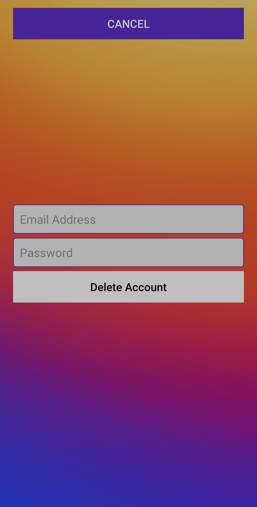

## Instagram Clone Android Kotlin

> 👷 Developed by Matheus Ramalho de Oliveira  
🔨 Brazilian Software Engineer  
🏡 Goiânia, Goiás, Brasil  
✉️ kastorcode@gmail.com  
👍 [instagram.com/kastorcode](https://instagram.com/kastorcode)

---

  

  A serverless Instagram frontend clone developed for Android using Firebase and Kotlin programming language on the <a href="https://udemy.com/share/102MnM" target="_blank">Make Social Networking App like Instagram - Kotlin, Firebase</a> course.

---

### Screenshots

  

  

  

  

  

  

  

  

  

  

  

  

  

---

### Tools used
[Android Studio](https://developer.android.com/studio)  
[Firebase](https://firebase.google.com)  
[Git](https://git-scm.com)  
[Kotlin](https://kotlinlang.org)  

---

  <big><b>&lt;kastor.code/&gt;</b></big>

